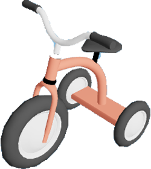

<a name="readme-top"></a>
[![Contributors][contributors-shield]][contributors-url]
[![Forks][forks-shield]][forks-url]
[![Stargazers][stars-shield]][stars-url]
[![Issues][issues-shield]][issues-url]
[![MIT License][license-shield]][license-url]
[![LinkedIn][linkedin-shield]][linkedin-url]
[](https://github.com/thomas-rooty/3d-portfolio/actions/workflows/node.js.yml)

<!-- PROJECT LOGO -->
<br />
<div align="center">
  <a href="https://github.com/thomas-rooty/tricycle-portfolio">
    
  </a>

<h3 align="center">3D Rendered Portfolio</h3>

  <p align="center">
    Made for fun, experiment, and to learn more about 3D rendering.
    <br />
    <a href="https://github.com/thomas-rooty/tricycle-portfolio"><strong>Explore the docs »</strong></a>
    <br />
    <br />
    <a href="https://3d.tcaron.fr">View Demo</a>
    ·
    <a href="https://github.com/thomas-rooty/tricycle-portfolio/issues">Report Bug</a>
    </p>
</div>


<!-- TABLE OF CONTENTS -->
<details>
  <summary>Table of Contents</summary>
  <ol>
    <li>
      <a href="#about-the-project">About The Project</a>
      <ul>
        <li><a href="#built-with">Built With</a></li>
      </ul>
    </li>
    <li>
      <a href="#getting-started">Getting Started</a>
      <ul>
        <li><a href="#prerequisites">Prerequisites</a></li>
        <li><a href="#installation">Installation</a></li>
      </ul>
    </li>
    <li><a href="#contributing">Contributing</a></li>
    <li><a href="#license">License</a></li>
    <li><a href="#contact">Contact</a></li>
  </ol>
</details>


<!-- ABOUT THE PROJECT -->

## About The Project

[![Product Name Screen Shot][product-screenshot]](https://3d.tcaron.fr)

### Built With

* [![Next][Next.js]][Next-url]
* [![React][React.js]][React-url]
* [![Three][Three.js]][Three-url]

<p align="right">(<a href="#readme-top">back to top</a>)</p>

<!-- GETTING STARTED -->

## Getting Started

This is an example of how you may give instructions on setting up your project locally.
To get a local copy up and running follow these simple example steps.

### Prerequisites

This is an example of how to list things you need to use the software and how to install them.

* npm
  ```sh
  npm install npm@latest -g
  ```

### Installation

1. Clone the repo
   ```sh
   git clone https://github.com/thomas-rooty/tricycle-portfolio.git
   ```
2. Install NPM packages
   ```sh
   npm install
   ```

<p align="right">(<a href="#readme-top">back to top</a>)</p>


<!-- CONTRIBUTING -->

## Contributing

Contributions are what make the open source community such an amazing place to learn, inspire, and create. Any
contributions you make are **greatly appreciated**.

If you have a suggestion that would make this better, please fork the repo and create a pull request. You can also
simply open an issue with the tag "enhancement".
Don't forget to give the project a star! Thanks again!

1. Fork the Project
2. Create your Feature Branch (`git checkout -b feature/AmazingFeature`)
3. Commit your Changes (`git commit -m 'Add some AmazingFeature'`)
4. Push to the Branch (`git push origin feature/AmazingFeature`)
5. Open a Pull Request

<p align="right">(<a href="#readme-top">back to top</a>)</p>


<!-- LICENSE -->

## License

Distributed under the MIT License. See `LICENSE.md` for more information.

<p align="right">(<a href="#readme-top">back to top</a>)</p>


<!-- CONTACT -->

## Contact

Project Link: [https://github.com/thomas-rooty/tricycle-portfolio](https://github.com/thomas-rooty/tricycle-portfolio)


<p align="right">(<a href="#readme-top">back to top</a>)</p>


<!-- MARKDOWN LINKS & IMAGES -->
<!-- https://www.markdownguide.org/basic-syntax/#reference-style-links -->

[contributors-shield]: https://img.shields.io/github/contributors/thomas-rooty/tricycle-portfolio.svg?style=for-the-badge

[contributors-url]: https://github.com/thomas-rooty/tricycle-portfolio/graphs/contributors

[forks-shield]: https://img.shields.io/github/forks/thomas-rooty/tricycle-portfolio.svg?style=for-the-badge

[forks-url]: https://github.com/thomas-rooty/tricycle-portfolio/network/members

[stars-shield]: https://img.shields.io/github/stars/thomas-rooty/tricycle-portfolio.svg?style=for-the-badge

[stars-url]: https://github.com/thomas-rooty/tricycle-portfolio/stargazers

[issues-shield]: https://img.shields.io/github/issues/thomas-rooty/tricycle-portfolio.svg?style=for-the-badge

[issues-url]: https://github.com/thomas-rooty/tricycle-portfolio/issues

[license-shield]: https://img.shields.io/badge/license-MIT-blue?style=for-the-badge

[license-url]: https://github.com/thomas-rooty/tricycle-portfolio/blob/production/LICENSE.md

[linkedin-shield]: https://img.shields.io/badge/-LinkedIn-black.svg?style=for-the-badge&logo=linkedin&colorB=555

[linkedin-url]: https://www.linkedin.com/in/dev-thomas-caron/

[product-screenshot]: /public/assets/icons/banner.png

[Next.js]: https://img.shields.io/badge/next.js-000000?style=for-the-badge&logo=nextdotjs&logoColor=white

[Next-url]: https://nextjs.org/

[React.js]: https://img.shields.io/badge/React-20232A?style=for-the-badge&logo=react&logoColor=61DAFB

[React-url]: https://reactjs.org/

[Three.js]: https://img.shields.io/badge/THREE-.JS-black

[Three-url]: https://github.com/mrdoob/three.js/

[Vue.js]: https://img.shields.io/badge/Vue.js-35495E?style=for-the-badge&logo=vuedotjs&logoColor=4FC08D

[Vue-url]: https://vuejs.org/

[Angular.io]: https://img.shields.io/badge/Angular-DD0031?style=for-the-badge&logo=angular&logoColor=white

[Angular-url]: https://angular.io/

[Svelte.dev]: https://img.shields.io/badge/Svelte-4A4A55?style=for-the-badge&logo=svelte&logoColor=FF3E00

[Svelte-url]: https://svelte.dev/

[Laravel.com]: https://img.shields.io/badge/Laravel-FF2D20?style=for-the-badge&logo=laravel&logoColor=white

[Laravel-url]: https://laravel.com

[Bootstrap.com]: https://img.shields.io/badge/Bootstrap-563D7C?style=for-the-badge&logo=bootstrap&logoColor=white

[Bootstrap-url]: https://getbootstrap.com

[JQuery.com]: https://img.shields.io/badge/jQuery-0769AD?style=for-the-badge&logo=jquery&logoColor=white

[JQuery-url]: https://jquery.com 